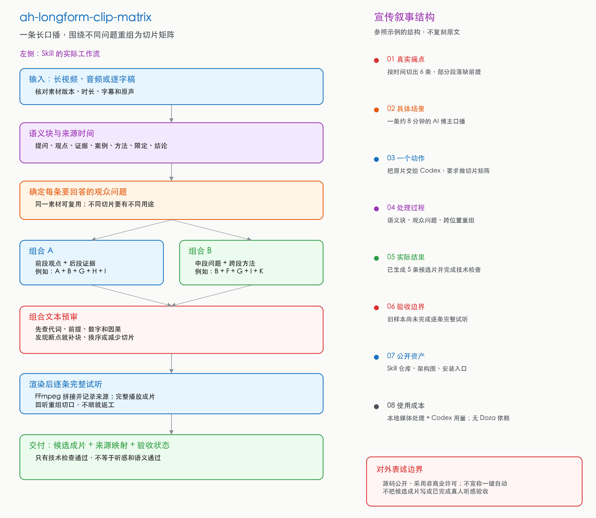

# 长内容切片矩阵

把一段长口播拆成语义块，再围绕不同观众问题重新排列，生成可以独立看懂的短切片。

这个 Skill 来自一次真实返工：第一次按连续时间段切出的 6 条视频都能播放，但有些段落离开原片后缺少前提或结论。改为跨位置重组后，5 条切片分别回答早期变现、平台激励、品牌价值、内容转化和从零起号的问题。

阿杭是产品经理出身的内容创业者。这里的重点是内容判断和可复用的交付流程，渲染脚本只是把已审好的组合准确做成文件。

## 工作方式

1. 对当前视频校时，拆出带源时间的语义块。
2. 给每条切片确定一个观众问题，再组合问题、解释、证据或做法、结论。
3. 检查代词、连接词、数字口径和因果关系。
4. 用渲染脚本生成 MP4，保留来源时间映射，再检查实际听感。

完整判断规则见 [SKILL.md](SKILL.md)。为什么这样设计，见 [设计哲思](docs/设计哲思.md)；对外介绍可用[可编辑 Skill 架构图](docs/长内容切片矩阵Skill架构.excalidraw)。本 Skill 已收录于[阿杭 Skills 工具目录](https://github.com/ahang008/ah-skills)。

## 安装与使用

把仓库链接发给 Codex，要求安装这个 Skill。安装后发送本地长视频、音频或逐字稿，并说“用 `ah-longform-clip-matrix` 做切片矩阵”。

合作推广：受众在跨境出海、独立开发、AI视频、模型测评。这些方向的商单可以找我。微信 Zephyr136。X：https://x.com/Astronaut_1216
